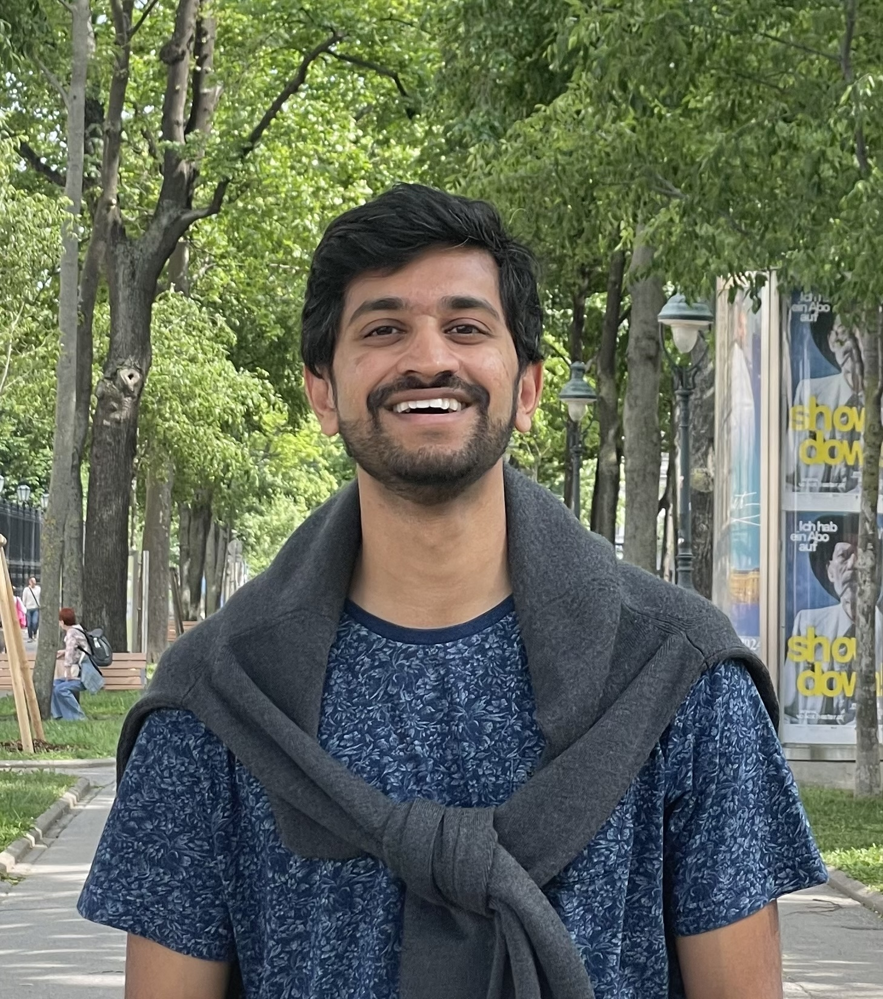

# Aravind Gollakota

I am an ML research engineer at Apple, working broadly on principled methods for reliable machine learning, including uncertainty quantification and related topics. My background is in computational learning theory and theoretical computer science. I received my PhD in CS at UT Austin in 2023 under [Adam Klivans](https://www.cs.utexas.edu/~klivans/), and my undergraduate degree in math and CS at Cornell University in 2017.

[Email](mailto:aravindprasant@gmail.com), [LinkedIn](https://www.linkedin.com/in/aravind-gollakota/)

## Papers

(authors in alphabetical order unless indicated by *)

- _Provable Uncertainty Decomposition via Higher-Order Calibration_  
  Gustaf Ahdritz, Aravind Gollakota, Parikshit Gopalan, Charlotte Peale, Udi Wieder  
  Submitted, 2024  
  [[arxiv]](https://arxiv.org/abs/2412.18808)
- _An Efficient Tester-Learner for Halfspaces_  
  Aravind Gollakota, Adam R. Klivans, Konstantinos Stavropoulos, Arsen Vasilyan  
  International Conference on Learning Representations (ICLR) 2024  
  [[arxiv]](https://arxiv.org/abs/2302.14853)
- _Agnostically Learning Single-Index Models using Omnipredictors_  
  Aravind Gollakota, Parikshit Gopalan, Adam R. Klivans, Konstantinos Stavropoulos  
  Neural Information Processing Systems (NeurIPS) 2023  
  [[arxiv]](https://arxiv.org/abs/2306.10615)
- _Ambient Diffusion: Learning Clean Distributions from Corrupted Data_  
  Giannis Daras, Kulin Shah, Yuval Dagan, Aravind Gollakota, Alexandros G. Dimakis, Adam R. Klivans (*)  
  Neural Information Processing Systems (NeurIPS) 2023  
  [[arxiv]](https://arxiv.org/abs/2305.19256)
- _Tester-Learners for Halfspaces: Universal Algorithms_  
  Aravind Gollakota, Adam R. Klivans, Konstantinos Stavropoulos, Arsen Vasilyan  
  Neural Information Processing Systems (NeurIPS) 2023 _(Oral presentation)_  
  [[arxiv]](https://arxiv.org/abs/2305.11765)
- _A Moment-Matching Approach to Testable Learning and a New Characterization of Rademacher Complexity_  
  Aravind Gollakota, Adam R. Klivans, Pravesh K. Kothari  
  Symposium on Theory of Computing (STOC) 2023 _(invited to SIAM Journal of Computing special issue)_  
  [[arxiv]](https://arxiv.org/abs/2211.13312) [[video]](https://www.youtube.com/watch?v=AWtG4v02k-M)
- _Hardness of Noise-Free Learning for Two-Hidden-Layer Neural Networks_  
  Sitan Chen, Aravind Gollakota, Adam R. Klivans, Raghu Meka  
  Neural Information Processing Systems (NeurIPS) 2022 _(Oral presentation)_  
  [[arxiv]](https://arxiv.org/abs/2202.05258) [[video]](https://slideslive.com/38991759/hardness-of-noisefree-learning-for-twohiddenlayer-neural-networks)
- _On the Hardness of PAC-learning Stabilizer States with Noise_  
  Aravind Gollakota, Daniel Liang  
  Quantum 6, 2022  
  [[arxiv]](https://arxiv.org/abs/2102.05174)
- _The Polynomial Method is Universal for Distribution-Free Correlational SQ Learning_  
  Aravind Gollakota, Sushrut Karmalkar, Adam R. Klivans  
  Technical note, 2020  
  [[arxiv]](https://arxiv.org/abs/2010.11925)
- _Statistical-Query Lower Bounds via Functional Gradients_  
  Surbhi Goel, Aravind Gollakota, Adam R. Klivans  
  Neural Information Processing Systems (NeurIPS) 2020  
  [[arxiv]](https://arxiv.org/abs/2006.15812) [[video]](https://slideslive.com/38937063/statisticalquery-lower-bounds-via-functional-gradients)
- _Superpolynomial Lower Bounds for Learning One-Layer Neural Networks using Gradient Descent_  
  Surbhi Goel, Aravind Gollakota, Zhihan Jin, Sushrut Karmalkar, Adam R. Klivans  
  International Conference on Machine Learning (ICML) 2020  
  [[arxiv]](https://arxiv.org/abs/2006.12011) [[video]](https://slideslive.com/38928430/superpolynomial-lower-bounds-on-learning-onelayer-neural-nets-with-gradient-descent)
- _Packing Tree Degree Sequences_  
  Aravind Gollakota, Will Hardt, István Miklós  
  Graphs and Combinatorics 36, 2020  
  [[arxiv]](https://arxiv.org/abs/1704.03148)

